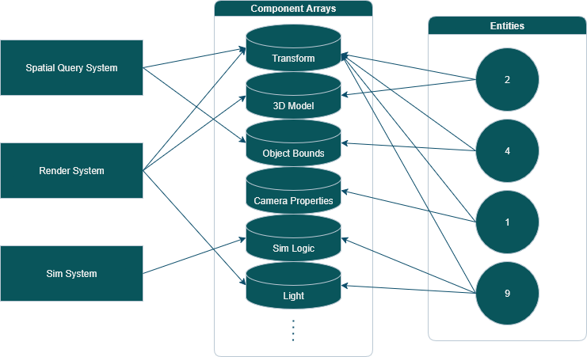

# ToyMaker: Core: Entity Component System

## What is it?

ECS is the primary way project data and behaviour is organized in the ToyMaker engine.

An ToyMaker::Entity is an object in a game known by its integer ID (ToyMaker::EntityID).  Conceptually, an entity is a logical container for components, or a key to an entry in a table.

An entity is made up of various data, each type of which is stored in a separate table (ToyMaker::ComponentArray) as a component, and related to the entity via its ID.  Each component holds data describing (an aspect of) an entity, but does not define any behaviour for it.

A ToyMaker::System is a module which operates on entities and their components in order to advance the state of the application.  Each system defines a set of components it expects an entity to have (taking the form of a ToyMaker::Signature).  When the system is executed, it may read or write its entities' components, and may also produce other important side effects.

## Important API

- ToyMaker::ComponentArray -- The table for components of a single ECS registered data type.

- ToyMaker::System -- The base class for any system wishing to plug in to the engine's ECS implementation, providing important methods and callbacks.

- ToyMaker::Entity -- A high level interface to this engine's ECS, offering object-oriented-like access to entity components and systems.

## Why does it exist?

Given that:

- A component array stores all data of a certain type, for all entities that have that component, in a single, tightly packed array.

- Different systems care about certain types of data associated with an entity, but not others.

- For any computer, reading and writing data from and to memory is relatively slow, and reading and writing from and to its cache is extremely quick.

- When a program accesses any data from memory, that data and its neighbours are pulled into the computer's cache (as specified by the platform's computer architecture).

A system, during its execution, will only require data from certain component tables, and will process them in a single batch.  When it accesses a component, the component's table is loaded into cache along with the requested component.  Any further reads and writes to this component array will occur on cache instead of on memory, resulting in a tremendous processing speed up.

Contrast this with a traditional object-oriented structure, where all data related to an entity is stored in a single data structure, and an array of such entities make up the game state.  A subsystem interested in processing a subset of an entity's properties, when it accesses those properties, will still cause properties unrelated to that subsystem to be loaded to cache, wasting precious cache capacity.  This process happens repeatedly over the course of the subsystem's run.

In many contexts, the convenience of the object-oriented organization outweigh the cost in performance.  In realtime applications such as games, however, performance is a non-negotiable requirement.
