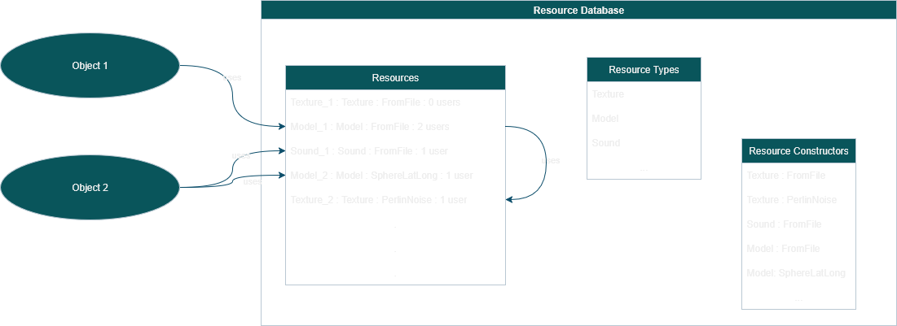

# ToyMaker: Core: Resource Database

## What is it?

A resource is any block of data used in different parts of a project.  The data may be a sound, a script, a shader, a texture, a 3D model, an entire scene, or something else entirely.

The resource database holds a list of definitions for resources used by the project, along with references to classes responsible for loading them into the application on request.

## Important API

- ToyMaker::ResourceDatabase -- A set of tables listing known resource types, known resource construction methods, and project-specific definitions of resources.

- ToyMaker::Resource -- A single resource, constructed on request and destroyed when no longer required by any part of the application.

- ToyMaker::ResourceConstructor -- A class representing a single method of constructing a resource.

## Why does it exist?

Most objects that are called resources are static, i.e., they do not change over time. This extends to the techniques used to load or construct them as well.  Take for example a font in an application, always loaded from a font file, and unchanged over that application's execution.

When a resource is required by an application, the resource may be in use simultaneously across multiple locations.  The same 3D model may be used by multiple enemies in a game scene at the same time, for example.

On the other hand, any two projects may require entirely different sets of resources.  Even within a single project, parts of it may require a resource that other parts do not.  Eg., UI buttons, useful in game menus, have no place in the HUD of a first-person shooter.

It is also often the case that a single type of resource has multiple means of construction.  Textures, for example, may be loaded from a file on-disk, but may also be procedurally generated using noise algorithms.

A resource database accounts for this by:

- Allowing resource data to be stored in files separate from the engine or application.

- Holding definitions to resources which may be used by the application, and loading or constructing them when they are requested by name.

- Holding named references to objects or functions responsible for the construction of resources by different means.

- Recording every live reference to a resource instance, so that when none exist, the resource may be removed, making space for other immediately useful resources.
